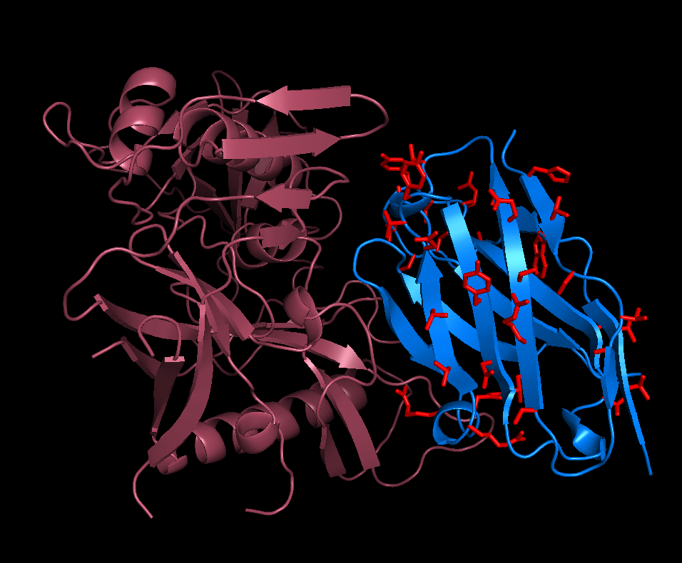

# zHIV
An HIV neutralizer

  

  zHIV (red and blue) shown bound to gp120 (salmon)

  Potential glycosylation sites on zHIV are shown in red.

  (based on 5TE4.PDB -- DOI:10.1016/j.immuni.2016.10.027)

This design is a glycosylated neutralizer based on the N6 antibody, an antibody that has been shown to effectively neutralize 98% of 181 different HIV isolates that it was tested against. The N6 antibody has the property that it binds the CD4 binding site on HIV's gp120 protein mostly with one chain -- the heavy chain. The light chain doesn't actually do very much. In fact, the paper describing the antibody suggests that it evolved to stay out of the way. This allowed the majority of the antibody to be cut away leaving a small molecule. By getting the light chain even more out of the way than it is in the original antibody, the neutralizer might be able to bind the CD4 binding site more effectively than the original complete antibody. It might even bind some of the HIV isolates that the original full sized N6 can't. It would be very nice to know if this is the case.

There is evidence that in many cases, an HIV infection is caused by a single virus particle which makes its way in and then spreads. This causes a "genetic bottleneck" that can be seen if the sequences of the virus is tracked from the beginning. Something the bottleneck data tells us is that the first viruses that get in have fewer glycosylation sites than ones that are the result of an infection that has been going on for a while. In other words, it appears that HIV may let down it's "glycan shield" a bit to get in. It's fair to speculate that the possible lack of glycans merely unmasks a binding site on the protein surface, the CD4 binding site for example. On the other hand, the glycans may be doing something else completely. For example they might be acting to hinder endocytosis that is not mediated by an interaction with CD4. If this is the case we might like the blocking molecule to be glycosylated to prevent alternative modes of HIV entry into host cells. There are also issues of solubility and mobility in mucus which glycosylation might help with. So the neutralizer is designed to be glycosylated.

