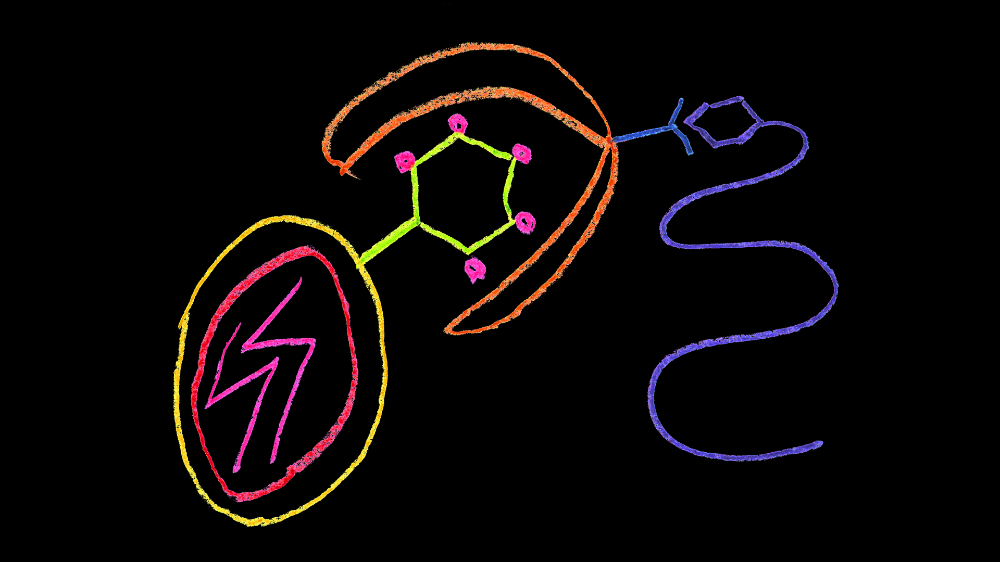

# zHIV
An HIV neutralizer

  

  Original design -- drawn May 10, 2016

This design has a bit of history. The original concept was drawn early in 2016. The picture isn't exactly drawn to scale, but here's the idea... On the left we have a couple of zig-zags representing genetic material surrounded by a pair of concentric enclosing curves. This is the HIV particle. Attached to the main particle is a hexagon. This a sugar, or a glycan. These come in many types strung together in chains of many lengths. HIV's env glycoprotein complex that protrudes from its outer membrane is coated with glycans. In this schematic drawing, somewhat enclosing the glycan is a butterfly like structure. This is a lectin. Lectins like to stick to glycans.

One current strategy for HIV prevention is to use lectins to bind to HIV's outer glycan coat to help prevent it from entering host cells. The picture as I've described it so far in some sense represents this strategy. Why this might be a good strategy is that according to the usual model of HIV viral replication, the first step of HIV viral entry is that the gp120 protein that is the main constituent of the env complex binds to the CD4 receptor on a target cell. By covering gp120 with lectin molecules, one aims to prevent this first step from occurring.

This is fine, but as far as I can tell, we don't really know for sure by what route HIV makes its initial entry to the body. HIV infection is an extremely rare event, and when it occurs, there is evidence in the form of the "genetic bottleneck" suggesting that in a significant number of cases, the infection was caused by the entry of a single HIV particle into a single host cell. This being the case, it is difficult to be completely sure about the mechanism that a single HIV particle uses to occasionally penetrate a single cell. Given that there are other mechanisms by which a virus can enter a host cell that do not depend on a particular interaction between gp120 and cd4, it may be prudent to consider some of these other mechanisms and how these might also be prevented.

One method by which a virus can enter a cell without depending on a particular receptor based interaction is called macropinocytosis. By this mechanism, cells can engorge and swallow things it finds in its environment without caring much about what it is. In principle, after a cell swallows something from its environment in this fashion, it gets broken down and recycled. In practice there is some evidence that a productive HIV infection might originate in this way. There are ways to reduce this method of entry into a cell, and for a protein, attaching a PEG (polyethylene glycol) chain to the molecule can reduce macropinocytosis. This is what the purple snake attached to the butterfly's antennae is meant to represent. So the complete design was for a pegylated HIV blocking lectin meant to attach to the glycans on HIV's coat.

There's something interesting about the mucosa, which is where this molecule was targeted for, as an HIV preventative measure. The mucosa is full of mucus. Mucus has lots of proteins known as mucins. Mucins are among the most heavily glycosylated molecules known. In other words, the mucins have lots of glycans just like HIV's gp120 molecule. So there is a significant chance that HIV blockers targeted at HIV's glycans might also bind the glycans that are attached to the mucins. So it's possible that many of the blocking molecules would get tangled up in the mucus without ever reaching their target.

So it seemed to me that a more specific binding interaction between the HIV blocker and the HIV particle would be desireable. But there's something else, something else about HIV's genetic bottleneck. As I've mentioned, this bottleneck reveals that in many cases the initial HIV infection comes from a single HIV particle. But these initial entrants have a very special property compared to HIV that's been participating in an infection for a while. The early entrants have fewer glycosylation sites. This could mean that the early entrants have fewer glycans, and this reduction in glycans could somehow be assisting the HIV particle's entry into the host.

Of course, one way to explain this data is to assume that the glycans are somehow masking the binding site between HIV and the host, the binding site between CD4 and gp120, and the reduction in the number of glycans better exposes the binding site making viral penetration more likely. Certainly this is a sensible interpretation. This is however, not the only possible interpretation. Maybe the glycans are acting to prevent the virus from entering the host independent of whatever influence they may be having over the binding sites. So maybe the blocking molecule should be heavily glycosylated so that we give potential HIV invaders that which is reduced in successful invaders. Incidentally, glycans might in a way similar to PEG, reduce macropinocytosis. So we have two reasons for switching from PEG to glycans for the HIV blocking molecule's coating.

  

  zHIV (red and blue) shown bound to gp120 (salmon)

  (based on 5TE4.PDB -- DOI:10.1016/j.immuni.2016.10.027)

Late in 2016, a very nice antibody appeared that binds to HIV on the gp120 protein at the CD4 binding site (DOI:10.1016/j.immuni.2016.10.027). It has "near pan" neutralization capability. It is named "N6." It was found to neutralize 98% of HIV isolates tested. It is this antibody that zHIV is based on. Antibodies are complicated beasts. There is a "light chain" and a "heavy chain," both of which have "hypervariable" regions from which the antibody's binding site is constructed. In the case of N6 however, the majority of the contact between N6 and the HIV particle was with N6's heavy chain. Indeed, one of the distinguishing features of N6 is that its light chain had evolved in such a way that "steric clashes" between the light chain and the HIV particle had been minimized. In other words, the light chain had evolved to stay out of the way.

This fortuitous feature of N6 provided an opportunity to create a blocking molecule that is small. Small molecules have some desirable features that might be useful to exploit in this case. Generally speaking, they move faster making them more likely to find their binding partner more quickly and easily than large molecules, and they can also be cheaper and easier to produce. So the essence of the design was to remove as much of the antibody as possible leaving only the heavy chain's terminal module which contains the binding region. In the above picture, we show the stripped down, small and fast molecular fragment bound to HIV's gp120 protein. Our fragment is shown in blue and red. The red portions indicate the 41 amino acid sidechains of possibly desirable glycosylation sites as determined by gly21 software. The actual locations for the glycosylation sites would be determined experimentally by finding out which of these 41 sites are efficiently expressed, efficiently glycosylated, and do not interfere excessively with binding.

